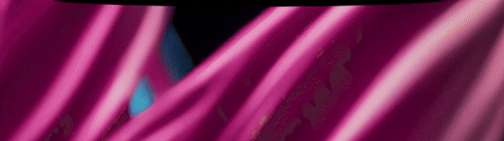

# ReversePrompt

**A notification for the moment a coding agent needs you, and nothing else.**



A Windows desktop app that tells you when a coding agent has finished or is waiting for an answer. A
drop of ink leaves the notch at the top of the screen, falls, and settles into a pill where the
message is typed out. It never takes focus, and a click brings back
the window the agent is running in.

It exists because an agent that stops to ask for permission is a process blocked on a human, and the
human is usually in another window. Terminal bells and system toasts are easy to miss; this one is
meant to be seen.

The messages are in French.

**Tauri 2 (Rust) · TypeScript · WebGL2 · Python adapters · Windows with WSL**

## The idea

The app knows no tool. It accepts one small JSON contract over a local HTTP endpoint and nothing
else. Each tool gets an **adapter**, outside the app, that translates the tool's own signals into
that contract. Today there is one adapter, for Claude Code (in WSL) and the Code tab of Claude
Desktop; Codex or OpenCode would add a second without touching the app.

```
tool hook ──(adapter: translate to the contract)──▶ detached curl.exe / PowerShell
      ──POST 127.0.0.1:47625/event──▶ Tauri app (Rust) ──▶ the island (TypeScript, WebGL2)
                                           ◀── click: focus the agent's window
```

An event has a source, a kind (`done`, `needs-input`, or `dismiss` when you took over yourself), a
session id, and optionally the window to return to and a short text. The full contract, including
the rules for de-duplication and for which event wins, is in `docs/event-contract.md`.

## Decisions worth knowing

- **The overlay never takes focus.** The window cannot be activated, and clicks pass through
  everywhere except on the pill, so the tabs under the notch stay clickable.
- **A hook must never slow the agent down.** Hooks hand off to a detached process, always exit 0,
  and the app answers before it processes anything. With the app stopped, the hook returns in under
  100 ms.
- **Content stays with the tool.** The adapter forwards no prompt and no model output to the app.
  The pill shows a generic line, not the agent's message.
- **Returning to the right tab.** Windows Terminal gives every tab the window's title, so the
  adapter sets a unique tab title per session and the app selects the matching tab on click.
- **Installation merges, never overwrites.** The installer adds its hooks to an existing
  `settings.json`, takes a timestamped backup first, can be re-run safely, and removes only what it
  added.
- **Local only.** The server listens on `127.0.0.1` and requires a token. The token keeps other
  programs and web pages from sending false notifications; it is not a defence against a process
  running under the same Windows account, and the contract document says so.
- **The animation is a small engine of its own.** A virtual clock, analytic springs and an SDF
  shader, with every value in one config file. This is what lets the playground slow it down or step
  it frame by frame.

## Getting started

Windows with WSL. The sources live in WSL; the Windows build runs on an NTFS mirror kept in sync
by a script, because `cargo` is not available inside WSL and building over `\\wsl.localhost` does not
work.

```bash
npm install
npm run win:install      # builds on the Windows side, installs the app, starts it at logon
# start ReversePrompt once from the Start menu, then:
npm run claude:install   # hooks for Claude Code (WSL) and Claude Desktop (Windows)
```

`npm run claude:uninstall` removes the hooks; the app is uninstalled from Windows settings.
`python3 adapters/claude/install.py --dry-run` shows what the installer would change without writing.

To work on the animation without the app:

```bash
npm run playground
```

Then open `http://127.0.0.1:5173/playground/` in a **Windows** browser. Keys: `D` done, `N` needs
you, `R` replay the entrance, `E` exit, `Space` pause, `→` next frame.

| Command | What it does |
| --- | --- |
| `npm run typecheck` | `tsc --noEmit` |
| `npm run test:adapters` | translation cases, installer (on copies) and hook scripts |
| `npm run win:test` | the Rust tests, on the Windows side |
| `npm run win:dev` | the app in development mode (start `npm run dev` first) |

## Limitations

- Windows only, and the adapter assumes Claude Code runs in WSL. The window-return code is Win32.
- Returning to the exact tab works in Windows Terminal only. The VS Code terminal, the Windows CLI
  and Claude Desktop bring back the window, not the tab.
- Telling Claude Code from Claude Desktop relies on environment variables that Anthropic does not
  document, and so may change.
- Ordinary chat conversations in Claude Desktop are not covered: there is no hook or API for the end
  of a reply that is stable and does not read private data.
- Several checks need a person at the screen and are listed in `docs/acceptance.md`: real clicks,
  120 Hz smoothness, sharpness at other display scales.

## Repository map

| Path | What is there |
| --- | --- |
| `src/` | The island: state machine, animation engine (`anim/`), WebGL2 shader (`blob/`), config |
| `src-tauri/` | The Windows app: overlay window, local server, focus handling, tray |
| `adapters/claude/` | Hook scripts, installer and tests for Claude Code and Claude Desktop |
| `playground/` | Page for tuning the animation live |
| `scripts/windows.mjs` | WSL to NTFS mirror and the `win:*` commands |
| `docs/event-contract.md` | The contract, and how to write an adapter |
| `docs/adapters/claude.md` | Verified facts about Claude's hooks, and the adapter |
| `docs/app.md`, `docs/windows-focus.md`, `docs/animation.md` | The app, returning focus under Windows, the animation |
| `docs/acceptance.md` | The manual acceptance checklist |
| `AGENTS.md` | Conventions and tooling traps for anyone, human or agent, working on this repo |

Documentation is in French; this page is not.

## Licence

**GPL-3.0**, like the author's other projects.

## Trademarks

Claude and Claude Code are trademarks of Anthropic. This project is neither affiliated with nor
endorsed by Anthropic. The icon files that reproduce those marks are not in the repository, although
the demo above shows one; without them the island shows a neutral icon.
