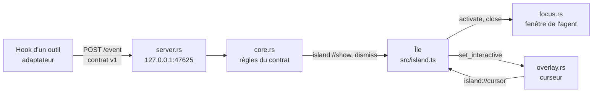

# L'app Windows (Tauri 2)

Ce document décrit ce que fait l'app, comment elle est construite et comment la déboguer.
Le format des événements qu'elle reçoit est dans `docs/event-contract.md` ; la façon d'en
ramener la fenêtre d'un agent dans `docs/windows-focus.md`.

## Vue d'ensemble



| Fichier (`src-tauri/src/`) | Rôle |
| --- | --- |
| `contract.rs` | lecture et validation du corps JSON (tests unitaires) |
| `core.rs` | le dernier gagne, dédoublonnage, `dismiss` par session, pause (tests unitaires) |
| `server.rs` | serveur HTTP (`tiny_http`), jeton, réponse avant traitement (test d'intégration) |
| `store.rs` | jeton, `config.json`, journal |
| `overlay.rs` | styles Win32 de la fenêtre, position du curseur |
| `focus.rs` | retrouver et ramener une fenêtre, surveiller le premier plan |
| `lib.rs` | assemblage : fenêtres, commandes appelées par l'île, zone de notification |

Côté page, `src/main.ts` monte l'île ; dans l'app, `src/app/bridge.ts` la relie aux événements
et commandes Tauri. Le **même** `src/island.ts` sert au playground.

## La fenêtre de l'île

- Créée au démarrage, **jamais redimensionnée ni déplacée ensuite**. Sa taille vient de
  `window.widthPx`/`heightPx` dans `src/config/animation.ts` : l'île l'envoie à l'app
  (`overlay_ready`), qui la place en haut au centre de l'écran principal, en pixels physiques
  (taille logique × facteur d'échelle de l'écran).
- Transparente, sans bordure ni ombre, absente de la barre des tâches et d'Alt+Tab
  (`WS_EX_TOOLWINDOW`), toujours au premier plan (`HWND_TOPMOST`, réaffirmé à chaque
  apparition), visible sur tous les bureaux virtuels.
- **Jamais activable** : `focusable(false)` de Tauri, doublé de `WS_EX_NOACTIVATE` posé à la
  main. Affichage par `SW_SHOWNOACTIVATE`.
- **Piège :** Tauri (tao) réécrit tout le style étendu quand il change un de ses réglages,
  notamment les clics traversants. `overlay::apply_styles` est rappelé après chaque changement.
- La fenêtre reste affichée en permanence ; île cachée, elle est entièrement transparente et
  traversée par les clics. Le rendu s'arrête (aucune boucle d'animation) : processeur au repos.

### Clics traversants

Tauri ne sait que « tout traverser » ou « tout capter ». La bascule suit donc la forme de la
pilule :

1. Tant que l'île est visible, un fil lit la position du curseur toutes les 16 ms
   (`GetCursorPos`, ramenée en pixels logiques dans le repère de la fenêtre) et l'envoie à la
   page quand elle change (`island://cursor`). Île cachée, ce fil dort.
2. La page teste `island.hitTest(x, y)` à chaque image (la pilule bouge sous un curseur
   immobile) et demande `set_interactive(true|false)` quand le résultat change.
3. Fenêtre captante, la page reçoit les clics : gauche → `activate` (ramène la fenêtre de
   l'agent), droit → `close` (ferme sans changer de fenêtre).

## Zone de notification

Menu : notification de test, ouvrir le playground (fenêtre normale, mêmes fichiers que
`npm run playground`), pause d'une heure, lancement au démarrage, quitter.

**Lancement au démarrage** (`tauri-plugin-autostart`, clé `Run` du registre utilisateur) :
activé au premier lancement d'un build de production, puis réécrit à chaque lancement s'il est
actif, pour pointer sur l'exécutable courant. Un build de développement n'y touche jamais.

Une seule instance à la fois (`tauri-plugin-single-instance`) : une seconde se ferme aussitôt.

## Fichiers

Dossier de données : `%APPDATA%\io.github.victorlabeille.reverseprompt\` — `token`,
`config.json` (voir le contrat) et `reverse-prompt.log`, journal borné à 256 Kio (puis
`.old`) : événements reçus et décision du cœur, états de l'île, résultat de chaque retour de
fenêtre. C'est le premier endroit où regarder quand « rien ne s'affiche ».

## Développer et déboguer

```bash
npm run dev          # Vite dans WSL (terminal 1)
npm run win:dev      # l'app côté Windows, qui charge ce Vite (terminal 2)
npm run win:test     # tests Rust
npm run win:install  # build de production, installeur, installation silencieuse
```

Envoyer un événement à la main, depuis WSL :

```bash
APPDATA_WSL=$(wslpath "$(cmd.exe /d /c echo %APPDATA% 2>/dev/null | tr -d '\r')")
TOKEN=$(cat "$APPDATA_WSL/io.github.victorlabeille.reverseprompt/token")
printf '%s' '{"v":1,"source":"generic","kind":"needs-input","session":"essai"}' |
  curl.exe -s -H "X-ReversePrompt-Token: $TOKEN" --data-binary @- http://127.0.0.1:47625/event
```

**Inspecter la page sans écran** (session verrouillée, agent sans accès à l'affichage) :
lancer l'app avec `WEBVIEW2_ADDITIONAL_BROWSER_ARGUMENTS=--remote-debugging-port=9229`, puis
lire `http://127.0.0.1:9229/json` et piloter la page par le protocole DevTools
(`Runtime.evaluate` pour lire `island.state`, `Page.captureScreenshot` pour une image). Les
captures d'écran Windows (`CopyFromScreen`) sortent noires quand la session est verrouillée.
