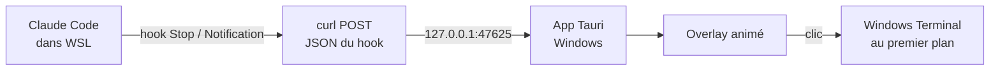
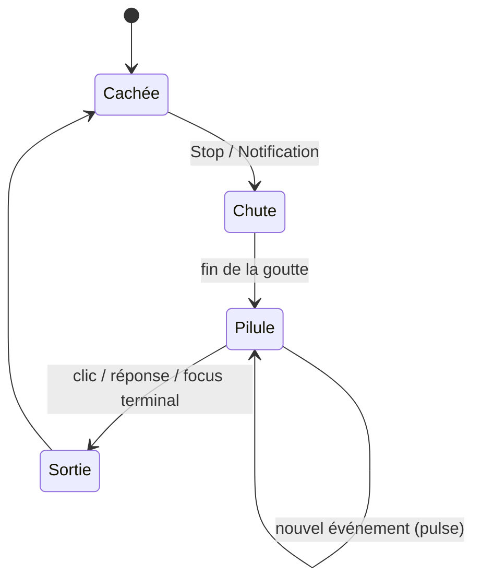

> **Statut : document d'entrée, pas un cahier des charges.** Rédigé par Victor le 2026-09-25 et
> versé tel quel dans le dépôt le 2026-09-26. Ce sont des recommandations et des pré-recherches :
> un choix fait ici n'a valeur de décision qu'une fois confirmé. Les écarts déjà tranchés sont
> listés dans `docs/animation.md` (« Écarts avec la spec v0.1 ») et dans `AGENTS.md`.

# Spec v0.1 — Notification « Dynamic Island » pour Claude Code (WSL)

Sep 25, 2026 · @Victor

## Objectif et périmètre

Une petite app Windows affiche une notification façon Dynamic Island dès que Claude Code (lancé dans WSL) a fini ou attend une réponse. Elle doit être visible par-dessus une vidéo en plein écran, sans jamais voler le focus ni gêner.

La v1 fait exactement trois choses :

- Montrer une notification animée (une goutte noire tombe du haut de l'écran et se transforme en pilule) quand Claude a besoin de moi.
- Afficher dans la pilule un petit personnage animé et un texte tiré au hasard dans une liste.
- Ramener au premier plan le terminal WSL quand je clique n'importe où sur la notification.

La v1 ne suit pas les outils en temps réel, n'affiche pas de consommation de tokens et ne permet pas d'approuver une permission depuis la notification.

Critère numéro un : la fluidité et la beauté de l'animation. En cas d'arbitrage, on privilégie le rendu sur les fonctionnalités.

## Architecture

Les hooks de Claude Code, côté WSL, envoient le JSON de l'événement en HTTP à un petit serveur local embarqué dans l'app Tauri, côté Windows. Aucun Node ni binaire custom n'est nécessaire dans WSL : un simple `curl` suffit.



Le serveur écoute uniquement sur `127.0.0.1`, port `47625` (configurable), route `POST /event`. Il accepte le JSON brut du hook, répond `204` immédiatement et traite l'événement ensuite.

Pour que `127.0.0.1` depuis WSL atteigne Windows, deux options :

1. Mode réseau mirrored de WSL (`networkingMode=mirrored` dans `%USERPROFILE%\.wslconfig`), puis `curl` Linux classique. Option par défaut.
2. Repli sans mirrored : appeler `curl.exe` (celui de Windows) depuis le hook via l'interop WSL. Il s'exécute côté Windows, donc son `127.0.0.1` est le bon.

Règles pour le hook : ne jamais ralentir ni bloquer Claude Code. Timeout de 1 seconde maximum, code de sortie toujours 0, même si l'app n'est pas lancée.

Sécurité minimale : un en-tête `X-Island-Token` avec un secret partagé (généré à l'installation), pour qu'aucun autre programme local ne puisse déclencher de fausses notifications.

## Événements et états

Deux hooks déclenchent l'apparition, deux autres la font disparaître. Les noms exacts des champs du JSON sont à vérifier dans la doc officielle des hooks Claude Code avant d'implémenter.

| Hook Claude Code | Signification | Effet sur l'île | Liste de textes |
| --- | --- | --- | --- |
| `Stop` | Claude a fini sa réponse | Apparaît | « Terminé » |
| `Notification` | Permission demandée ou attente prolongée | Apparaît (ou se met à jour si déjà visible) | « Besoin de toi » |
| `UserPromptSubmit` | J'ai répondu dans le terminal | Disparaît | — |
| `SessionEnd` | Session fermée | Disparaît | — |

L'île disparaît aussi quand je clique dessus, et quand Windows Terminal repasse au premier plan par un autre moyen (Alt+Tab, clic dans la barre des tâches).



Règles de gestion :

- Dédoublonnage : un `Notification` d'attente qui arrive après un `Stop` de la même session, alors que l'île est déjà visible, ne relance pas l'animation. Il met juste le texte à jour avec un léger pulse.
- Plusieurs sessions : le dernier événement gagne. L'app garde le `session_id` et le `cwd` du dernier événement pour savoir quel terminal ramener au premier plan.
- Un événement reçu pendant l'animation de sortie annule la sortie et revient à l'état Pilule, sans saut visuel.

## Direction visuelle et animation

Une goutte d'encre noire se détache du bord haut de l'écran, tombe, s'écrase et s'étale en pilule, comme un liquide. Tout est noir pur, sans bordure, centré en haut de l'écran principal.

### Séquence

Les durées et ressorts ci-dessous sont des valeurs de départ, à régler dans le playground.

| Étape | Ce qu'on voit | Réglage de départ |
| --- | --- | --- |
| 1. Formation | Une petite bosse gonfle au bord haut de l'écran, puis s'étire en goutte reliée par un fil de liquide | \~180 ms |
| 2. Chute | Le fil casse, la goutte tombe d'environ 40 px en s'étirant verticalement (squash & stretch) | \~220 ms, accélération type gravité |
| 3. Impact et étalement | La goutte s'écrase et s'étire horizontalement en pilule, avec un léger dépassement élastique | Ressort : raideur 380, amortissement 26 |
| 4. Contenu | Le personnage apparaît (échelle 0,6 → 1), puis le texte (flou → net, +4 px → 0) avec 60 ms de décalage | Démarre à 90 % de la largeur finale |
| 5. Attente | Seul le personnage bouge. Un petit rebond de rappel toutes les 30 s si je n'ai pas réagi | Rappel désactivable |
| 6. Sortie | Le contenu s'efface (120 ms), la pilule se rétracte en goutte et remonte dans le bord de l'écran | \~350 ms, inverse de l'entrée |

Au clic, la pilule s'enfonce légèrement (échelle 0,97) avant la sortie, pour un retour tactile.

### Forme

- Pilule de départ : environ 340 × 48 px (pixels logiques), rayon maximal, à 10 px du haut.
- La largeur s'adapte à la longueur du texte, animée par ressort.
- La forme est rendue par un shader WebGL (champs de distance signés fusionnés avec un minimum lisse) : bords parfaitement anti-crénelés, fusion liquide réaliste. Repli possible : filtre SVG « goo ».
- Le contenu (personnage, texte) est en HTML au-dessus du canvas.

### Personnage

- Un petit personnage original (de ma création), environ 32 px, à gauche du texte.
- v1 : dessiné en SVG et animé par le code (clignement, petit balancement au repos, animation plus excitée pour une permission). Claude Code peut tout produire lui-même.
- Plus tard, si je le dessine dans l'éditeur Rive : remplacer par un fichier `.riv` avec machine à états (entrée, repos, excité). Claude Code ne sait pas créer de fichier `.riv`, mais il peut l'intégrer.

### Textes

- Deux listes dans `messages.json` : « terminé » et « besoin de toi », en français.
- Tirage aléatoire, sans répéter le même texte deux fois de suite.
- 32 caractères maximum par texte. Police blanche, Segoe UI Variable, 15 px, graisse 500.

### Thème

Toutes les couleurs, rayons et ombres passent par des variables CSS regroupées dans un fichier de thème. Le thème « noir » est le seul de la v1 ; un thème « faux verre » (reflets, bordure lumineuse) doit pouvoir s'ajouter sans toucher au code des animations.

## Interaction

Toute la pilule est cliquable, sans aucun bouton. Un clic gauche ramène Windows Terminal au premier plan, puis l'île sort.

- Survol : curseur main et léger grossissement (échelle 1,02, ressort doux).
- Clic gauche : retour tactile (échelle 0,97), focus du terminal, animation de sortie.
- Clic droit : fermer l'île sans changer de fenêtre (utile en pleine vidéo).

### Mise au premier plan du terminal

- Trouver les fenêtres Windows Terminal (processus `WindowsTerminal.exe`) et prendre la plus récemment active.
- La restaurer si elle est réduite, puis la passer au premier plan via l'API Win32, côté Rust.
- Piège connu : Windows refuse souvent qu'une app donne le focus à une autre, surtout depuis une fenêtre non activable comme notre overlay. Il faut utiliser une méthode éprouvée pour contourner ce verrou et la tester sur plusieurs cas : terminal réduit, derrière une vidéo plein écran, sur un autre bureau virtuel.
- v1 : on ramène la fenêtre, pas un onglet précis. Le ciblage d'onglet est une piste future.

## Contraintes fenêtre et performance

Une seule fenêtre transparente, de taille fixe, créée au démarrage et jamais redimensionnée ni déplacée pendant une animation. Toute l'animation se joue à l'intérieur. C'est la règle la plus importante pour la fluidité.

### Fenêtre

- Taille fixe d'environ 520 × 140 px (pixels logiques), assez grande pour la pilule la plus large et la chute de la goutte. Collée au bord haut, centrée sur l'écran principal.
- Sans bordure, sans ombre système, fond transparent, absente de la barre des tâches et d'Alt+Tab.
- Toujours au premier plan, au niveau le plus haut, réaffirmé à chaque apparition. Elle doit passer au-dessus d'une vidéo en plein écran dans un navigateur. Les jeux en plein écran exclusif sont hors périmètre.
- Jamais activable : afficher la fenêtre ne doit ni voler le focus, ni faire sortir une vidéo du plein écran, ni capter le clavier.
- Clics traversants : quand l'île est cachée, la fenêtre laisse passer tous les clics. Quand elle est visible, seuls les clics sur la pilule sont captés. Tauri ne gère que le tout ou rien, donc basculer selon la position du curseur par rapport à la forme de la pilule.
- Écrans haute densité : tout est exprimé en pixels logiques, compatible avec la mise à l'échelle Windows (150 % ou 200 %).

### Performance

- Objectif : 120 images par seconde sur l'écran du Yoga, aucune image au-delà de 8,3 ms pendant les animations.
- N'animer que des transformations, l'opacité et les paramètres du shader. Jamais `width`, `height`, `top` ou `left` en CSS.
- Une seule boucle de rendu, active uniquement quand l'île est visible ou en animation. Quand elle est cachée : processeur au repos, aucun rendu.
- Préchauffage au démarrage : compiler le shader, charger la police et le personnage, et jouer une animation invisible une fois. La toute première notification ne doit pas saccader.
- Mémoire indicative : moins de 100 Mo au total, WebView2 compris.

## Stack et structure du projet

Tauri 2 côté système, TypeScript sans framework côté affichage : l'interface tient en un seul composant, un framework n'apporterait que du poids.

| Brique | Choix | Rôle |
| --- | --- | --- |
| App et fenêtre | Tauri 2 (Rust) | Overlay, icône de notification, lancement au démarrage |
| Serveur local | Petit serveur HTTP Rust | Réception des événements des hooks |
| API Windows | Crate `windows` | Premier plan, fenêtre non activable, focus du terminal |
| Affichage | TypeScript + Vite, sans framework | Machine à états et contenu |
| Forme liquide | Shader WebGL2 écrit à la main | Goutte et pilule |
| Animations | Motion (motion.dev) | Ressorts pilotant le shader et le contenu |
| Playground | Tweakpane | Curseurs de réglage |

Toutes les valeurs d'animation (durées, ressorts, tailles, flou) vivent dans un seul fichier de configuration. Le code n'en contient aucune en dur.

```
island/
├── src-tauri/
│   └── src/
│       ├── main.rs
│       ├── server.rs        # HTTP 127.0.0.1:47625
│       ├── overlay.rs       # premier plan, non activable, clics traversants
│       ├── focus.rs         # Windows Terminal au premier plan
│       └── tray.rs
├── src/
│   ├── main.ts              # machine à états
│   ├── blob/                # shader et rendu de la forme
│   ├── character/           # personnage SVG et ses animations
│   ├── config/animation.ts  # toutes les valeurs réglables
│   ├── theme/black.css
│   └── messages.json
├── playground/              # page de réglage
├── hooks/                   # installation côté WSL
└── SPEC.md
```

## Playground de réglage

Le playground est livré en même temps que la première animation, pas après. C'est là que je règle la sensation à la main, au lieu de décrire « plus fluide » en mots.

- Page de développement qui utilise exactement le même code de rendu que l'app, sur un fond au choix : noir, blanc, capture d'une vidéo.
- Curseurs Tweakpane pour chaque valeur du fichier de configuration : durées, raideur et amortissement de chaque ressort, taille de la goutte, hauteur de chute, douceur de fusion du liquide, décalages du contenu.
- Boutons : rejouer l'entrée, rejouer la sortie, simuler « terminé », simuler « besoin de toi », simuler un clic.
- Ralenti x0,25 et lecture image par image, pour inspecter la fusion de la goutte.
- Compteur d'images par seconde et durée de la pire image affichés en permanence.
- Bouton « Copier la config » qui exporte les valeurs actuelles en TypeScript, prêtes à coller dans le fichier de configuration.
- Accessible depuis le menu de l'icône de notification, et en `npm run playground` pendant le développement.

## Installation et démarrage

L'installation tient en trois étapes : installer l'app Windows, activer le réseau mirrored de WSL, lancer le script d'installation des hooks dans WSL.

### Côté Windows

- Installeur généré par Tauri. Au premier lancement, l'app crée un secret partagé dans son dossier de données et active le lancement au démarrage de Windows.
- Menu de l'icône de notification : notification de test, ouvrir le playground, pause (ne rien afficher pendant une heure), quitter.
- Activer le réseau mirrored dans `%USERPROFILE%\.wslconfig`, puis `wsl --shutdown` :

```ini
[wsl2]
networkingMode=mirrored
```

### Côté WSL

Un script `hooks/install.sh` copie le secret depuis Windows, installe le script de notification et ajoute les hooks à `~/.claude/settings.json` sans écraser ceux qui existent déjà. Il est relançable sans risque.

Script de notification, un seul pour tous les événements (le type d'événement est dans le JSON) :

```bash
#!/bin/sh
# ~/.claude/island/notify.sh
curl -s -m 1 -X POST \
  -H "Content-Type: application/json" \
  -H "X-Island-Token: $(cat ~/.claude/island/token)" \
  --data-binary @- http://127.0.0.1:47625/event >/dev/null 2>&1
exit 0
```

Hooks ajoutés à `~/.claude/settings.json` (même commande pour `Notification`, `UserPromptSubmit` et `SessionEnd`) :

```json
{
  "hooks": {
    "Stop": [
      { "hooks": [{ "type": "command", "command": "~/.claude/island/notify.sh" }] }
    ]
  }
}
```

Le format exact du fichier de réglages et des hooks est à vérifier dans la doc officielle de Claude Code au moment de l'implémentation.

## Critères d'acceptation

La v1 est terminée quand tous ces tests passent sur le Yoga Pro 7i, à la main.

- [ ] Une réponse terminée de Claude Code dans WSL fait apparaître l'île en moins de 300 ms.
- [ ] Une demande de permission fait apparaître l'île avec un texte de la liste « besoin de toi ».
- [ ] Pendant une vidéo YouTube en plein écran : l'île apparaît par-dessus, la vidéo reste en plein écran et continue de réagir au clavier.
- [ ] Clic gauche sur l'île : Windows Terminal passe au premier plan, y compris s'il était réduit.
- [ ] Clic droit : l'île disparaît, la fenêtre active ne change pas.
- [ ] Répondre dans le terminal fait disparaître l'île.
- [ ] Quand l'île est cachée, les clics en haut de l'écran atteignent bien les fenêtres dessous (onglets du navigateur, par exemple).
- [ ] Le playground affiche 120 images par seconde sans image au-delà de 8,3 ms, entrée et sortie comprises, y compris pour la première notification après le démarrage.
- [ ] App cachée : processeur proche de 0 %.
- [ ] App fermée : Claude Code fonctionne normalement, sans délai visible ni message d'erreur.
- [ ] Rendu net à 150 % et à 200 % de mise à l'échelle.

## Hors périmètre v1 et pistes futures

Ces idées sont volontairement repoussées pour garder la v1 petite et soignée.

- Thème « faux verre » : reflets, bordure lumineuse, léger dégradé. Le vrai verre avec flou du bureau est peu réaliste sur une forme animée.
- Personnage en Rive, avec machine à états, si je le dessine dans l'éditeur Rive.
- Ciblage de l'onglet Windows Terminal exact de la session, et pas seulement de la fenêtre.
- Affichage du nom du projet (déduit du `cwd`) dans la pilule.
- File d'attente et badge quand plusieurs sessions attendent en même temps.
- Son discret à l'apparition, désactivable.
- Support des écrans multiples (île sur l'écran où se trouve la souris).
